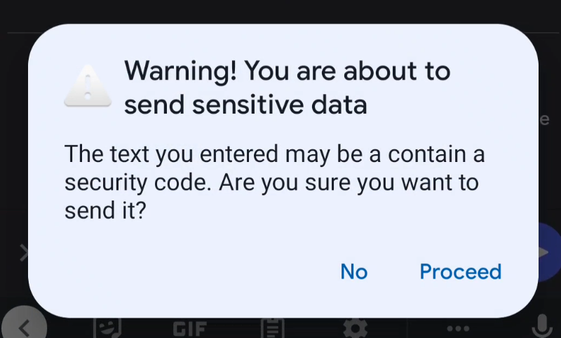
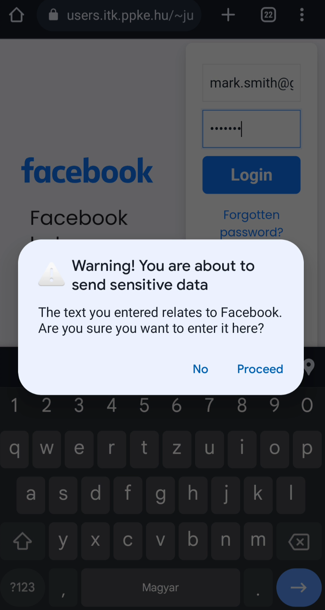

# KEYPER

Have you ever opened a dangerous website and entered your password without noticing that it was not the real page you were looking for?
Our project's focus was on increasing awereness about the ever growing problem of phishing (sites looking like the ones we use daily or people impersonating a trusted one asking for sensitive information). If this goes unnoticed then you might be giving out your precious data to fraudsters. With the advanced comversational capabilities of stat-of-the-art Large Language Models, chances are, conversation based phising attacks will be on the rise.

We believe that with Keyper, the chance of anyone giving out their password by accident will drop significantly.

Our application helps you detect these scenarios and prevent you from giving your passwords and other informations to third parties with malicious intentions.
We manage to do this using a local password bank and checking your context (application, website url). After any update occurs in the active textbox (writing or deleting characters, copy-pasting), the app checks the content against a secure password manager databank.
In case it detects that you typed in a password or other saved data like a bank account number in an unsafe context, our app alerts you. 
This way you know that you are not on the original website you were meant to be on.
We also try to emphasize the importance of not sharing your passwords through unsecure channels in a similar fashion.
Furthermore, Keyper can detect  incoming One Time Passwords, storing them in a temporary storage as sensitive data. This can help prevent social engineering attack on Two-Factor Authentication (2FA).

To reach this goal we used the following technologies:
 - Android Studio
 - Java
 - Accessability service
 - NotificationListener service
 - KeePass standard

Our future plans include making this service available on desktop machines through browser extensions, making a public website containing a list of recently popular phising types. 
Through analysed user feedback data, we can also establish a blacklist of sites that have been flagged as potentially malicious multiple times.
Integration with other types of password banks is also on our agenda.

## Running the fully working demo app:
- Clone the repo and build the app with Android Studio, or
- Download the prebuilt APK file from [here](app/release/app-release.apk) and install it on your Android device

You will need to enable installing applications downloaded from your browser of choice.

The demo app expects an encrypted [keepass](https://keepass.info/) file at the root of the phone's internal storage with the name  `keyper.kdbx`.

Enter the password in the app, grant the necessary permissions and turn on the accessibility service.

Keyper sends an alert if sensitive data is input into a field where it shouldn't.

Keyper can also detect 2FA codes from SMS and treats these as sensitive as well.
## As it is apparent from the source code, the demo version does has no network communication!

## Alerts you receive if you enter sensitive information to the wrong place:

### 2FA

### Password

